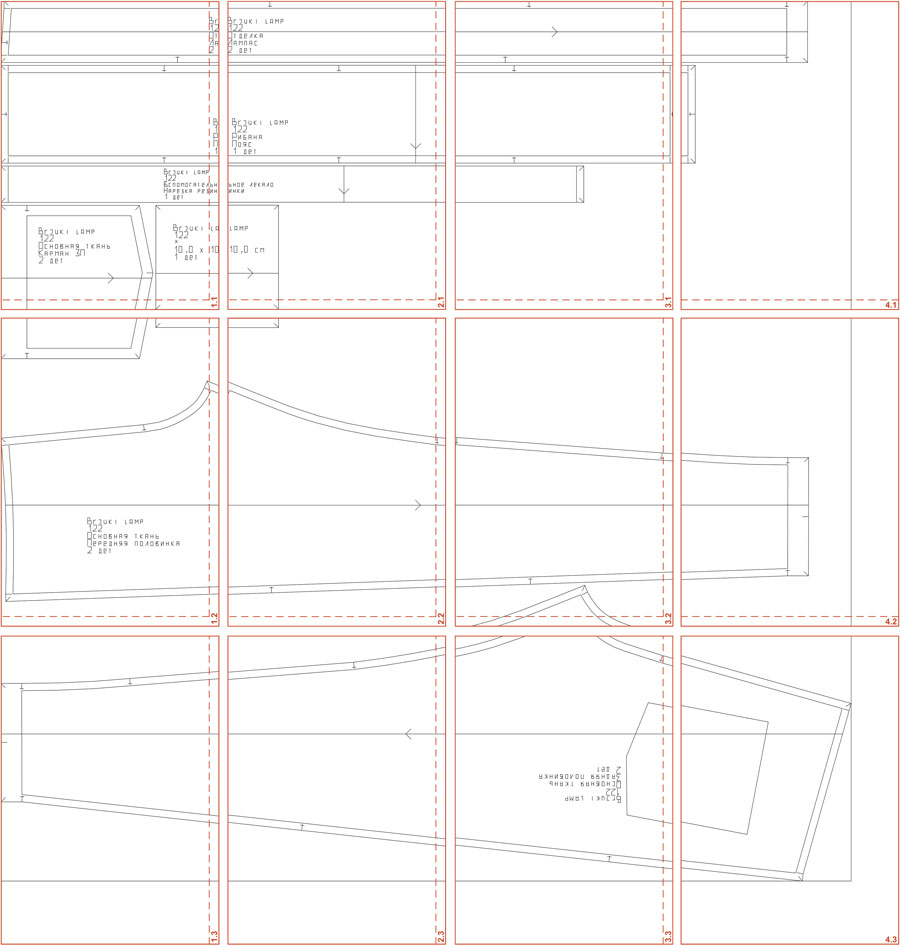

# PDF Poster Splitter

Десктопное приложение для нарезки широкоформатных PDF (постеры, выкройки) на листы стандартных форматов. Нарезанные листы содержат поля для склейки с перекрытием, пунктирные линии отреза и нумерацию координат сетки — всё, чтобы распечатать на обычном принтере и собрать оригинал.

Дополнительно: водяные знаки из логотипа и титульный лист.

Пример разбивки:

## Использование

1. Укажите **Из папки** — папку с исходными PDF. Программа рекурсивно найдёт и обработает все PDF внутри неё.
2. Укажите **В папку** — папку для результатов. Структура подпапок сохраняется. Существующие файлы с совпадающими именами будут перезаписаны (с подтверждением).
3. Заполните настройки нарезки:
   - **Формат бумаги** — размер тайла (A4, A3 и т.д.)
   - **Отступ для склейки (мм)** — ширина поля перекрытия между листами (по умолчанию 10 мм)
4. При необходимости заполните настройки водяных знаков:
   - **Логотип** — PNG-файл, накладывается сеткой на каждый постер
   - **Ширина логотипа (мм)** — ширина одного экземпляра в сетке (по умолчанию 50 мм)
   - **Прозрачность логотипа (%)** — 0–100 % (по умолчанию 30 %)
5. При необходимости укажите **Титульный лист** — PDF-файл, первая страница которого добавляется в начало каждого результата.
6. Нажмите **Начать**. Прогресс отображается двумя индикаторами: по файлам и по тайлам текущего файла. Обработку можно отменить кнопкой **Отменить**.

Все настройки автоматически сохраняются и восстанавливаются при следующем запуске. Кнопка **Сбросить к настройкам по умолчанию** возвращает все поля к исходным значениям.
